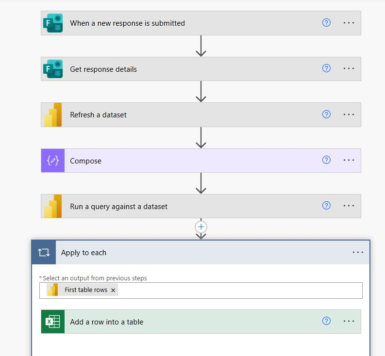

# ⚡ Automated Survey Analytics Solution | Microsoft Forms, Power Automate & Power BI

## Project Overview

This project demonstrates an end-to-end automated reporting solution built using Microsoft Forms, Power Automate, Power BI, and Excel.

The solution automatically captures user responses from Microsoft Forms, refreshes Power BI datasets, dynamically filters data based on submitted responses, executes DAX queries against the Power BI semantic model, and exports the results into Excel for reporting and operational use.

The workflow eliminates manual reporting processes and enables near real-time analytics and automated decision support.

---

## 🎯 Business Objective

The objective of this solution is to automate the collection, processing, and reporting of survey responses by:

- Capturing Microsoft Forms submissions automatically
- Refreshing Power BI datasets
- Filtering Power BI data based on user inputs
- Executing analytical DAX queries
- Exporting query results into Excel
- Reducing manual effort and reporting delays

---

## 🏗️ Solution Architecture

```text
Microsoft Forms
        │
        ▼
Power Automate Trigger
(New Response Submitted)
        │
        ▼
Get Response Details
        │
        ▼
Power BI Dataset Refresh
        │
        ▼
Dynamic DAX Query Execution
(Filter using Form Responses)
        │
        ▼
Process Query Results
        │
        ▼
Excel Table Update
        │
        ▼
Business Reporting
```

---

## 📸 Workflow Overview



---

## 🔄 Workflow Process

### Step 1: Form Submission

Users submit information through Microsoft Forms.

### Step 2: Retrieve Response Data

Power Automate captures all submitted form values.

### Step 3: Dataset Refresh

The workflow automatically refreshes the Power BI dataset to ensure data accuracy.

### Step 4: Dynamic Query Execution

Power Automate executes DAX queries against the Power BI semantic model.

Example filtering logic:

```DAX
EVALUATE
FILTER(
    Employee,
    Employee[Country] = "Selected Country"
)
```

### Step 5: Data Processing

Query results are processed and structured for reporting.

### Step 6: Excel Integration

The workflow automatically inserts returned records into an Excel table.

---

## 📊 Key Features

### Automated Reporting

- No manual data extraction required
- Automated report generation

### Dynamic Filtering

- Form responses drive Power BI query filters
- Personalized data retrieval

### Dataset Refresh Automation

- Ensures up-to-date reporting data
- Eliminates stale reporting issues

### Excel Integration

- Automated row insertion
- Centralized reporting repository

---

## 🛠️ Technologies Used

### Microsoft Power Platform

- Microsoft Forms
- Power Automate
- Power BI

### Data Processing

- DAX Queries
- Power BI Semantic Model

### Reporting

- Excel Online
- Automated Data Export

---

## 💡 Skills Demonstrated

### Power Platform

- Power Automate Workflow Design
- Microsoft Forms Integration
- Power BI Integration

### Business Intelligence

- Semantic Model Querying
- DAX Development
- Automated Reporting

### Process Automation

- Event-Driven Workflows
- Dataset Refresh Automation
- Data Integration

### Data Analytics

- Dynamic Filtering
- Data Extraction
- Report Automation

---


## Business Value

This solution reduces manual reporting effort, improves reporting accuracy, and enables automated analytics workflows by integrating Microsoft Forms, Power Automate, Power BI, and Excel into a single end-to-end reporting platform.

---
